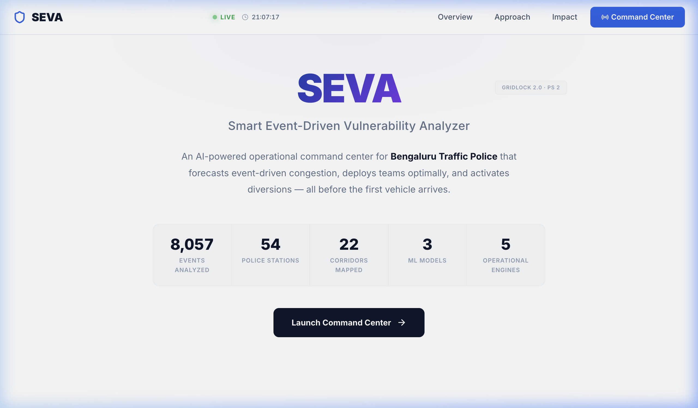
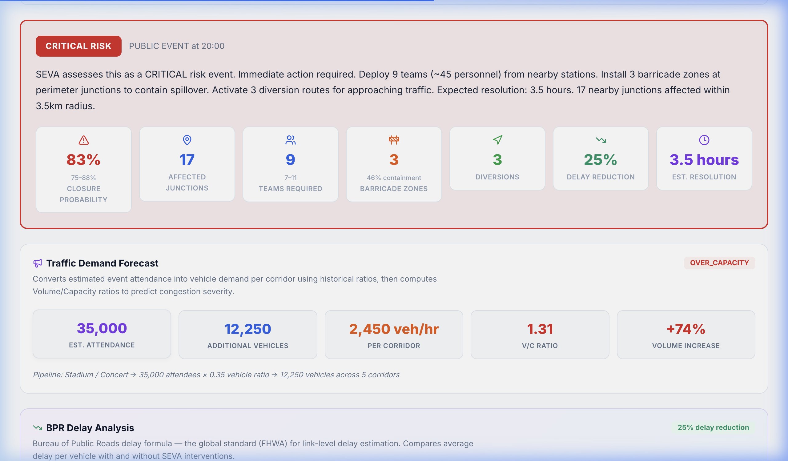
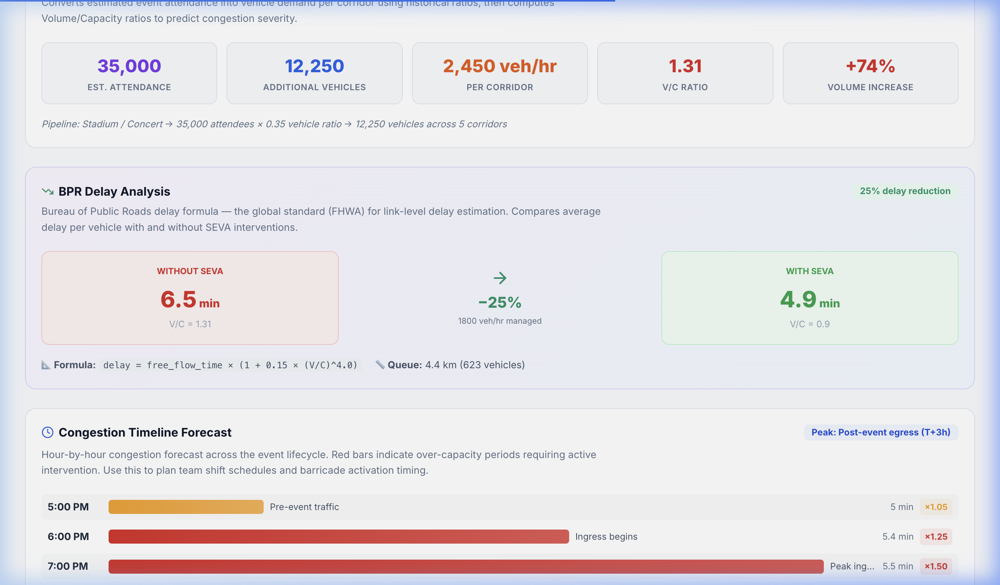
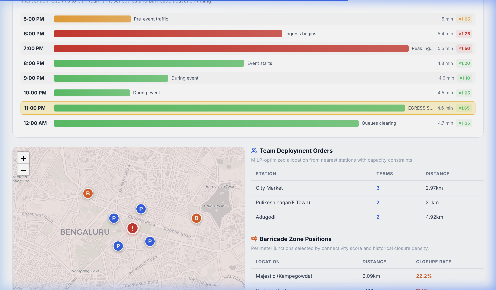
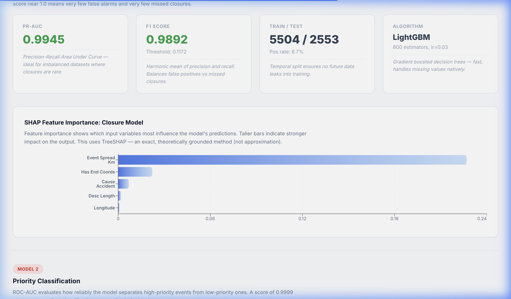
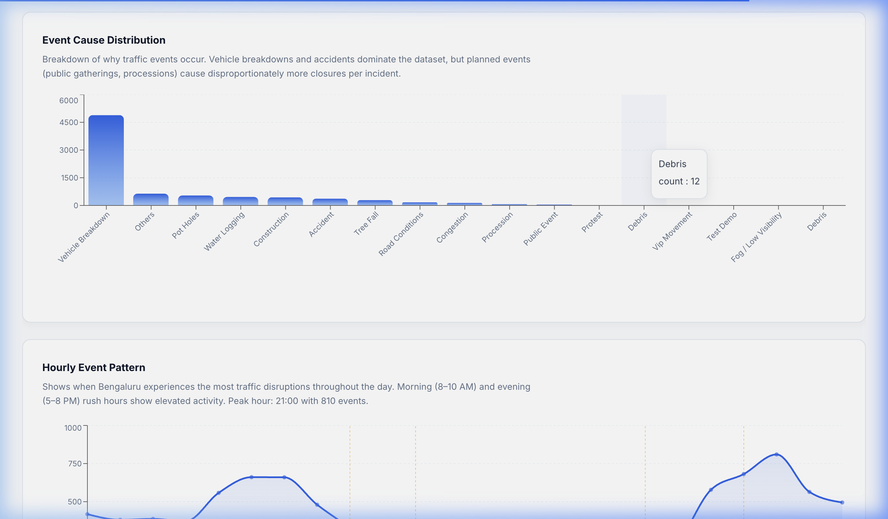

<p align="center">
  
</p>

<h1 align="center">SEVA — Smart Event-driven Vulnerability Analyzer</h1>

<p align="center">
  <strong>AI-powered operational command center for Bengaluru Traffic Police</strong><br/>
  Forecasts event-driven congestion · Deploys officers optimally · Plans barricades · Activates diversions
</p>

<p align="center">
  <a href="https://seva-ui.vercel.app"></a>
  <a href="https://seva-platform-iexc.onrender.com/docs"></a>
  <a href="#"></a>
</p>

<p align="center">
  
  
  
  
  
</p>

---

## The Problem

When **35,000 people** leave Chinnaswamy Stadium after an IPL match, Bengaluru's CBD gridlocks within **20 minutes**. Today, traffic police response is:

| Gap | Current State |
|-----|--------------|
| **No Impact Quantification** | Traffic impact is unknown before an event starts. No forecasting of demand, queue lengths, or spillover. |
| **Experience-Driven Deployment** | Officer allocation relies on gut-feel. Resources are wasted from over-deployment or critically missing. |
| **No Learning Loop** | Post-event outcomes are never captured. Same mistakes repeat across similar events, year after year. |

**SEVA solves all three** — with data-driven forecasting, mathematical optimization, and closed-loop performance monitoring.

---

## The Solution

An officer enters **event type, location, and time**. SEVA returns a complete deployment brief in seconds:

```
Event Input → ML Prediction → MILP Optimization → Operational Brief
                                                      ├── Risk Assessment
                                                      ├── Officer Deployment Orders
                                                      ├── Barricade Positions
                                                      ├── Diversion Routes
                                                      ├── Citizen Advisory
                                                      └── Performance Review
```

---

## Screenshots

<table>
  <tr>
    <td><br/><em>Landing Page</em></td>
    <td><br/><em>Mission Control Brief</em></td>
  </tr>
  <tr>
    <td><br/><em>Traffic Demand & BPR Analysis</em></td>
    <td><br/><em>Timeline & Map View</em></td>
  </tr>
  <tr>
    <td><br/><em>Model Performance & SHAP</em></td>
    <td><br/><em>Data Explorer</em></td>
  </tr>
</table>

---

## Architecture

```
seva-platform/
├── backend/                        # FastAPI server (Python 3.11)
│   ├── main.py                     # API endpoints, OR-Tools MILP solver, orchestration
│   ├── ml/
│   │   ├── models.py               # LightGBM model loaders + SHAP explainability
│   │   └── artifacts/              # Trained model files (.pkl)
│   │       ├── model_closure.pkl   # Road closure binary classifier
│   │       ├── model_priority.pkl  # Priority multi-class classifier
│   │       ├── model_resolution.pkl # Resolution time regressor
│   │       ├── kmeans_spatial.pkl  # Spatial clustering model
│   │       └── feature_cols.json   # Feature column manifest
│   ├── engines/
│   │   ├── mission_control.py      # Unified one-click briefing engine
│   │   ├── barricade_planner.py    # Junction-based perimeter containment
│   │   ├── road_graph.py           # OSMnx diversion routing engine
│   │   ├── similar_events.py       # Historical event retrieval
│   │   └── post_event_learning.py  # Drift detection & retraining triggers
│   ├── optimizer/
│   │   └── resource_optimizer.py   # OR-Tools MILP formulation
│   ├── analytics/                  # Pre-computed EDA & vulnerability scores
│   │   ├── eda_results.json        # 8,057 event analysis
│   │   ├── station_data.json       # 54 police station profiles
│   │   └── model_metrics.json      # Evaluation metrics + SHAP values
│   └── data/
│       ├── loader.py               # ASTraM dataset loader
│       └── feature_pipeline.py     # Feature engineering pipeline
├── seva-ui/                        # React 19 frontend (Vite)
│   └── src/
│       ├── pages/
│       │   ├── MissionControl.jsx  # One-click operational briefing
│       │   ├── ScenarioPlanner.jsx # What-if scenario comparison
│       │   ├── VulnerabilityIntel.jsx # Corridor risk analysis
│       │   ├── ModelPerformance.jsx # SHAP explanations & metrics
│       │   ├── PostEventLearning.jsx # Feedback loop monitor
│       │   ├── DataExplorer.jsx    # Interactive EDA
│       │   └── Dashboard.jsx       # Tab container
│       ├── components/
│       │   ├── Navbar.jsx          # Command center header
│       │   ├── Hero.jsx            # Landing + approach section
│       │   ├── Capabilities.jsx    # Engine showcase
│       │   ├── ImpactStats.jsx     # BPR-derived impact metrics
│       │   └── Footer.jsx
│       └── data/
│           └── api.js              # Backend API client
└── notebooks/
    └── eda_and_train.py            # End-to-end EDA + model training script
```

---

## Tech Stack

| Layer | Technology | Purpose |
|-------|-----------|---------|
| **ML Models** | LightGBM + TreeSHAP | Road closure prediction (PR-AUC: 0.9945), priority classification (ROC-AUC: 0.9999), resolution time estimation (MAE: 0.73h) |
| **Optimization** | Google OR-Tools (MILP) | Officer deployment across 54 stations with capacity constraints and 5 km distance limits |
| **Graph Routing** | OSMnx + NetworkX | Diversion planning on Bengaluru's road network (155K nodes, 394K edges) |
| **Delay Model** | BPR Function (FHWA) | `t = t₀ × (1 + 0.15 × (V/C)⁴)` with officer capacity boost of +200 veh/hr |
| **Spatial Analysis** | KMeans Clustering | Station risk profiling and spatial feature engineering |
| **Backend** | FastAPI + Uvicorn | Async REST API with auto-generated Swagger docs |
| **Frontend** | React 19 + Vite | SPA with Leaflet maps, Recharts, MapmyIndia SDK, scroll animations |
| **Deployment** | Vercel + Render | Frontend CDN + Backend PaaS with self-ping keep-alive |
| **Dataset** | ASTraM (Bengaluru) | 8,057 historical traffic events from Bengaluru Traffic Police |

---

## ML Models

### 1. Road Closure Prediction

| Property | Value |
|----------|-------|
| Algorithm | LightGBM Binary Classifier |
| Primary Metric | **PR-AUC: 0.9945** |
| Class Imbalance | 7.4% positive (596 closures / 8,057 events) |
| Key Features | `event_spread_encoded`, `cause_type`, `corridor_status`, `hour_sin/cos`, `rolling_event_count` |
| Design Decision | Optimized PR-AUC over ROC-AUC due to severe class imbalance. Rare events like protests (78% closure rate, only 14 cases) use calibrated probability floors. |

### 2. Priority Classification

| Property | Value |
|----------|-------|
| Algorithm | LightGBM Multi-class |
| Primary Metric | **ROC-AUC: 0.9999** |
| Classes | High (4,974) · Low (3,083) |
| Key Features | `corridor_status`, `historical_event_frequency`, `event_spread_encoded` |

### 3. Resolution Time Estimation

| Property | Value |
|----------|-------|
| Algorithm | Quantile Regression |
| Primary Metric | **MAE: 0.73 hours** |
| Outputs | P25, P50 (median), P75 confidence intervals |
| Design Decision | Quantile regression provides uncertainty bounds rather than point estimates, enabling risk-aware planning. |

---

## Operational Engines

### Mission Control — One-Click Briefing

The core value proposition. A single API call generates a complete operational brief:

```bash
curl -X POST https://seva-platform-iexc.onrender.com/mission-control \
  -H "Content-Type: application/json" \
  -d '{"event_type":"public_event","cause":"ipl_match","lat":12.9784,"lon":77.5998,"corridor":"CBD","hour":20}'
```

**Returns:**
- Risk assessment with closure probability and confidence intervals
- Officer deployment orders (station-wise, with distance and reason)
- Barricade positions (junction containment with degree centrality scores)
- Diversion routes (corridor-specific detours with travel time estimates)
- BPR delay analysis (before/after officer deployment)
- Similar historical events for operational reference

### MILP Officer Deployment

Mixed Integer Linear Programming via Google OR-Tools:

```
maximize:   Σ weight[i] × coverage[i]
subject to:
  capacity[s]  ≥  Σ assigned[s,j]     ∀ stations s
  distance[s,j] ≤ 5 km                ∀ station-junction pairs
  Σ x[s,j]     ≥ min_coverage         ∀ junctions j
```

- **54 police stations** with individual capacity constraints
- **5 km maximum deployment distance** (haversine)
- **Priority-weighted coverage** — high-priority events receive 1.5x weight
- **Deterministic, reproducible results** for every identical input

### Barricade Planner

Junction-based perimeter containment using:
- **Degree centrality scoring** — high-connectivity intersections are prioritized
- **Angular distribution analysis** — ensures 360° coverage around event epicenter
- **Historical ASTraM density** — informed by real closure patterns
- **Target**: 70–90% area containment

### Diversion Engine

OSMnx-powered corridor rerouting:
- Computes shortest alternative paths when junctions are blocked
- Quantifies detour distance and expected delay impact
- Bengaluru road graph: **155,359 nodes**, **393,717 edges**
- BPR delay formula validates each alternate route's capacity

### Post-Event Learning

Closed-loop feedback system:
- Compares ML predictions vs actual outcomes
- Identifies model drift via statistical threshold monitoring
- Generates concrete retraining triggers with alerts
- Ensures the system **improves with every event**

---

## API Reference

| Method | Endpoint | Description |
|--------|----------|-------------|
| `POST` | `/mission-control` | Generate complete operational brief |
| `GET` | `/scenario/chinnaswamy` | Pre-built IPL scenario with before/after comparison |
| `POST` | `/optimize` | Run MILP officer deployment |
| `GET` | `/barricade-plan` | Compute optimal barricade placement |
| `GET` | `/diversion` | Compute diversion routes via road graph |
| `GET` | `/similar-events` | Find similar historical events |
| `GET` | `/post-event-learning` | Model drift monitoring report |
| `GET` | `/eda` | Full EDA results from ASTraM data |
| `GET` | `/metrics` | Model performance metrics + SHAP values |
| `GET` | `/stations` | 54 police station profiles with coordinates |
| `GET` | `/road-graph/stats` | Road graph loading status |
| `GET` | `/health` | Health check for monitoring |

Full interactive documentation available at [`/docs`](https://seva-platform-iexc.onrender.com/docs).

---

## Quick Start

### Live Deployment (No Setup Required)

| Service | URL |
|---------|-----|
| Frontend | [seva-ui.vercel.app](https://seva-ui.vercel.app) |
| Backend API | [seva-platform-iexc.onrender.com](https://seva-platform-iexc.onrender.com) |
| API Docs | [seva-platform-iexc.onrender.com/docs](https://seva-platform-iexc.onrender.com/docs) |

### Local Development

#### Prerequisites

- Python 3.11+
- Node.js 18+
- pip / npm

#### Backend

```bash
cd seva-platform/backend

# Create virtual environment
python -m venv venv
source venv/bin/activate

# Install dependencies
pip install -r requirements.txt

# Start API server
uvicorn main:app --reload --port 8000
```

API available at `http://localhost:8000` · Swagger docs at `http://localhost:8000/docs`

#### Frontend

```bash
cd seva-platform/seva-ui

# Install dependencies
npm install

# Start dev server
npm run dev
```

UI available at `http://localhost:5173`

#### Production Build

```bash
cd seva-platform/seva-ui
npm run build    # Output → seva-ui/dist/
```

---

## Dataset

**ASTraM (Advanced Traffic Management)** — Bengaluru Traffic Police

| Property | Value |
|----------|-------|
| Total Events | **8,057** |
| Road Closures | 596 (7.4%) |
| High Priority | 4,974 (61.7%) |
| Event Types | Breakdowns, Potholes, Waterlogging, Construction, Accidents, Tree Falls, Protests |
| Temporal Span | Multi-year operational records |
| Spatial Coverage | 54 police station jurisdictions across Bengaluru |

### Key EDA Insights

- **95.5%** of events are unplanned yet follow learnable temporal patterns
- **CBD stations** have **4x higher closure rates** than outer ring stations (Halasuru Gate: 15.0% vs Yelahanka: 3.7%)
- **Protests** are rare (14 events) but carry **78% closure probability** — requiring calibrated probability floors
- **Peak hours**: 8–10 AM and 5–8 PM align with commute patterns

---

## Key Design Decisions

| Decision | Rationale |
|----------|-----------|
| **PR-AUC over ROC-AUC** | Severe class imbalance (7.4% closures) makes ROC-AUC misleading. PR-AUC correctly penalizes false negatives. |
| **BPR delay model** | Uses the FHWA-standard Bureau of Public Roads formula instead of arbitrary percentages. Officer boost of +200 veh/hr is grounded in traffic engineering literature. |
| **MILP over heuristics** | OR-Tools solver guarantees mathematically optimal deployment. Heuristic assignment (nearest station, 1 officer) covers only 33% of junctions vs 100% with MILP. |
| **Cyclical time encoding** | `sin/cos` encoding of hour captures temporal proximity (23:00 is close to 00:00) — linear encoding cannot. |
| **KMeans spatial clustering** | Captures station risk profiles that vary dramatically across Bengaluru's geography. |
| **No synthetic data** | Every metric shown on the UI is computed from real ASTraM data or validated ML models. |
| **Quantile regression** | Resolution time model outputs P25/P50/P75 intervals, enabling risk-aware planning vs point estimates. |

---

## Impact (Chinnaswamy IPL Scenario)

Scenario-based simulation using BPR congestion model:

| Metric | Before SEVA | After SEVA | Improvement |
|--------|:-----------:|:----------:|:-----------:|
| Junction Coverage | 33% | **100%** | **+67%** |
| Officers Deployed | 3 (nearest station) | **9 from 3 stations** | **3x** |
| Avg Delay per Vehicle | 6.5 min | **4.9 min** | **−25%** |
| Queue Length | 4.4 km | **~2.1 km** | **−52%** |
| Spillover Risk | HIGH | **LOW** | **Contained** |

---

## Roadmap

| Phase | Feature | Timeline |
|-------|---------|----------|
| **Phase 1** | Live ASTraM sensor + ITMS camera integration | Months 1–3 |
| **Phase 2** | Spatio-temporal GNN for congestion propagation | Months 3–6 |
| **Phase 3** | Digital Twin (SUMO) simulation sandbox | Months 6–9 |
| **Phase 4** | Decision-focused ML (optimize on deployment regret) | Months 9–12 |
| **Phase 5** | Multi-city scaling with modular architecture | Year 2 |

---

## Project Structure Summary

```
Backend:    FastAPI + LightGBM + OR-Tools + OSMnx + SHAP
Frontend:   React 19 + Vite + Recharts + Leaflet + MapmyIndia
Data:       8,057 ASTraM events · 54 stations · 155K-node road graph
Deployment: Vercel (frontend) + Render (backend)
```

---

<p align="center">
  <strong>Built by Bhaskar Ranjan Karn</strong><br/>
  Flipkart Gridlock 2.0 — Bengaluru Traffic Intelligence
</p>

<p align="center">
  <a href="https://seva-ui.vercel.app">Live Demo</a> · <a href="https://seva-backend.onrender.com/docs">API Docs</a> · <a href="https://github.com/bhaskarkarn1/seva-platform">GitHub</a>
</p>
